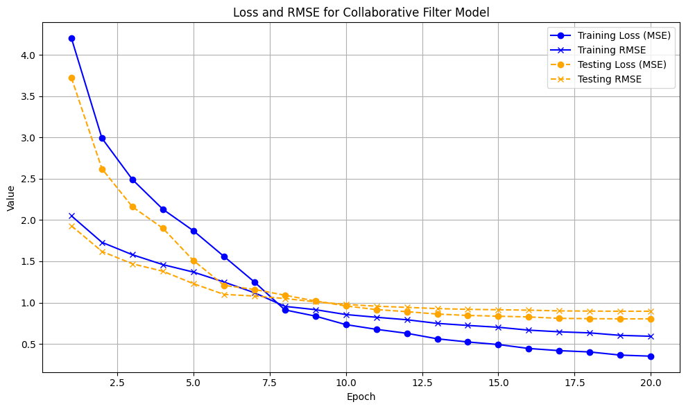

# AI-Travel Companion (Travel Recommender) Project Report

---

## Table of Contents

- [Introduction](#introduction)
- [Project Description](#project-description)
- [Workflow](#workflow)
  - [Countries Recommender](#countries-recommender)
  - [AI Travel Agent Chatbot](#ai-travel-agent-chatbot)
- [Module Breakdown](#module-breakdown)
  - [Countries Recommender](#countries-recommender-1)
  - [AI Travel Agent Chatbot](#ai-travel-agent-chatbot-1)
- [Methodologies and Approaches](#methodologies-and-approaches)
  - [Recommendation Generation](#recommendation-generation)
  - [Natural Language Processing (NLP) Model](#natural-language-processing-nlp-model)
- [Datasets](#datasets)
- [Results](#results)
- [Comparison with Existing Methods](#comparison-with-existing-methods)
- [References](#references)

---

## Introduction

The travel industry is evolving rapidly with the integration of artificial intelligence (AI) technologies. The AI-Travel Companion project aims to revolutionize the travel experience by providing personalized recommendations to travelers based on their preferences, interests, and historical data and it also gives its user access to an AI travel Agent with its custom commands. This report presents an overview of the AI-Travel Companion system, its functionalities, methodologies, and results.

## Project Description

The AI-Travel Companion is designed to assist travelers in planning their trips efficiently. It incorporates machine learning algorithms to analyze user preferences to generate customized travel recommendations. The system offers suggestions for countries they should visit and a map to view and see some of the destinations in that country with real-time data requested through API.

## Workflow

The AI-Travel Companion project consists of two main modules, so I will discuss their workflow separately:

### Countries Recommender

The Countries Recommender module comprises the following sub-modules:
- Popularity Recommender: Assigns popularity scores to countries using its algorithm (details provided in the Modules section).
- Collaborative Filter Recommender: Uses an Artificial Neural Network (ANN) model to predict ratings for countries.
- Content-based Recommender: Calculates similarity scores for countries based on user preferences.

Each sub-recommender loads the necessary dataset and performs preprocessing specific to its algorithm. The recommendations from these sub-recommenders are then combined using a Weighted Hybrid Recommender, which employs a weighted sum method to generate final recommendations. These recommendations are displayed through a Graphical User Interface (GUI), allowing users to view details about countries, explore cities from the city dataset, and access popular spots and accommodations fetched from APIs.

### AI Travel Agent Chatbot

The second module, AI Travel Agent Chatbot, utilizes the Llama3 model with a persona of a personal travel agent. It responds to user requests, providing personalized travel recommendations and assistance.

The workflow of the AI-Travel Companion project ensures accurate and relevant travel recommendations by leveraging multiple recommendation techniques and interactive user interfaces.

## Module Breakdown

The AI-Travel Companion system comprises the following modules:

### Countries Recommender

The Countries Recommender module includes the following sub-recommenders:
- Popularity Recommender
- Content-based Recommender
- Collaborative Filter Recommender

The recommendations from these sub-recommenders are then combined using a Weighted Hybrid Recommender, which employs a weighted sum method to generate final recommendations. These recommendations are displayed through a Graphical User Interface (GUI), allowing users to view details about countries, explore cities from the city dataset, and access popular spots and accommodations fetched from APIs.

### AI Travel Agent Chatbot

The AI Travel Agent Chatbot module can be divided into two submodules:
- Chat with the AI Travel Agent
- Command in the Chat

## Methodologies and Approaches

The AI-Travel Companion employs a variety of machine learning techniques and natural language processing (NLP) model to enhance recommendation accuracy and user experience.

### Recommendation Generation

The system uses a combination of supervised and unsupervised machine learning techniques for recommendation generation:
- Collaborative Filtering
- Content-based Filtering
- Popularity Recommender
- Hybrid Recommendation Approach

### Natural Language Processing (NLP) Model

NLP model is employed for text analysis of the user's chat to the bot to generate country cards and also for chatting with users and providing personalized responses.

These methodologies and approaches collectively contribute to the AI-Travel Companion's ability to deliver accurate, diverse, and personalized travel recommendations while ensuring a seamless user experience.

## Datasets

The AI-Travel Companion uses various datasets including World Countries Dataset, World Cities Dataset, Ratings Dataset, and World Popularity Dataset. These datasets are crucial for generating personalized recommendations and enhancing user experience.

## Results

The AI-Travel Companion's Collaborative Filter Recommender has been evaluated using Mean Square Error (MSE) and Root Mean Square Error (RMSE) metrics, with the best model achieving a loss of 0.58 and RMSE of 0.74. The system's performance ensures accurate and reliable travel recommendations.

## Comparison with Existing Methods

The AI-Travel Companion's hybrid recommendation approach, integration of popularity and visitor analysis, and interactive chatbot module set it apart from traditional travel recommendation systems. The system's ability to generate personalized, context-aware, and up-to-date travel recommendations, coupled with interactive chatbot interactions, positions it as a leading solution for modern travelers seeking tailored and engaging travel experiences.

## References

For external libraries and datasets used in the project, refer to the following links:
- [Geoapify Products and Services API](https://www.geoapify.com/products-and-services)
- [Ratings and Popularity Datasets on Kaggle](https://www.kaggle.com/datasets/datamanthedune/countries-popularity/data)
- [World Cities and Countries Datasets on Kaggle](https://www.kaggle.com/datasets/max-mind/world-cities-database)
- [CTkinter Library for GUI](https://github.com/TomSchimansky/CustomTkinter)
- [TkinterMapView for Maps GUI Library](https://github.com/TomSchimansky/TkinterMapView)
- [Llama3 API](https://huggingface.co/spaces/FumesAI/llama-3-API)

